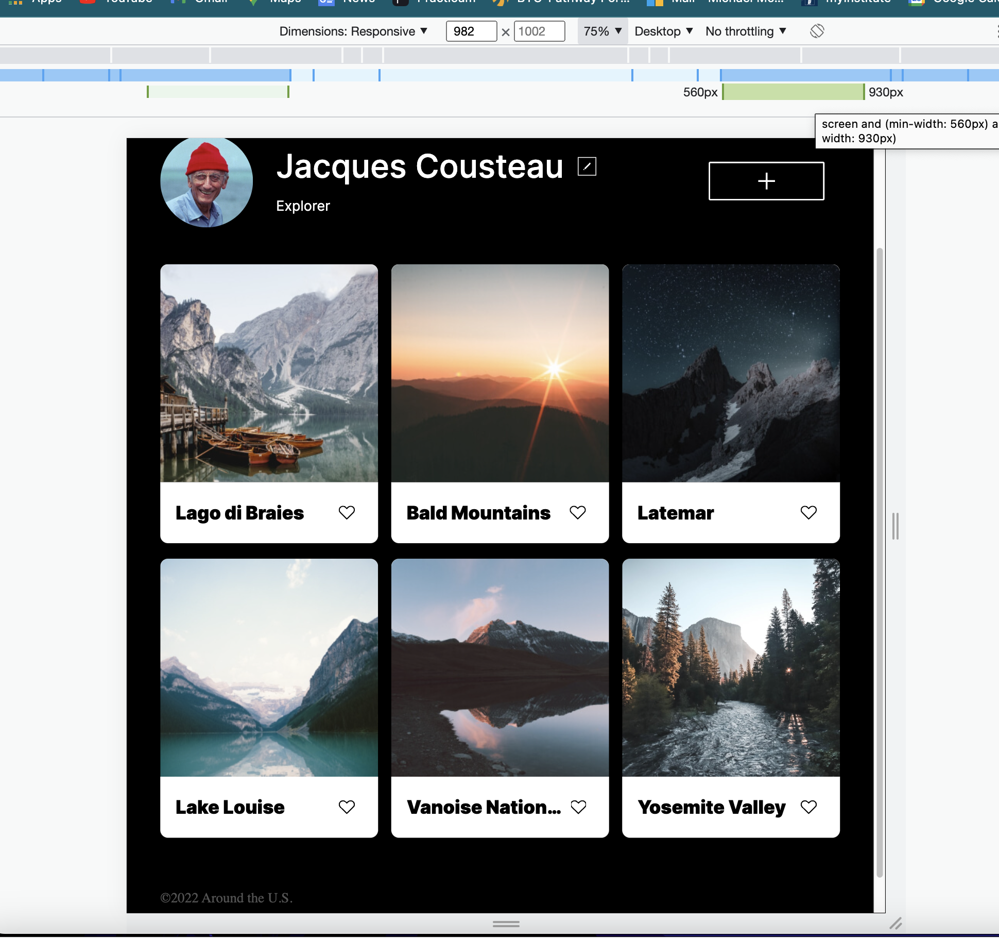

Project 3 Around the U.S.

This is the Third Project at the Practicum Web Development Program where our pages come to life. We followed a design on Figma and created a responsive website.

We utlilized many of the latest web responsive design web tools while creating this page. Here is a list of some of them.

- HTML Semantics

- CSS Custom Properties

- Positioning

- Media Queries

- SVG's

- Grid layout

- Flexbox

- Responsive Web Design

 

 
 
 

[Link to Git Hub Pages]

https://mmcevoy114.github.io/se_project_aroundtheus/
